# zdsim Architecture

A compact agent-based model built on [Starsim](https://starsim.org) that answers a single research question:

> **How many tetanus cases and deaths are averted if routine pentavalent delivery in Kenya is scaled up enough to roughly halve the under-5 zero-dose share?**

This document walks through the moving parts end-to-end — with Mermaid diagrams, a class map, per-module tables, and a timestep trace.

---

## Table of contents

1. [System at a glance](#1-system-at-a-glance)
2. [Repository map](#2-repository-map)
3. [Data → calibration → simulation flow](#3-data--calibration--simulation-flow)
4. [Core data structures](#4-core-data-structures)
5. [Simulation anatomy (what lives inside `ss.Sim`)](#5-simulation-anatomy-what-lives-inside-sssim)
6. [Timestep execution order](#6-timestep-execution-order)
7. [Disease modules](#7-disease-modules)
8. [ZeroDoseVaccination intervention](#8-zerodosevaccination-intervention)
9. [Analyzers and outputs](#9-analyzers-and-outputs)
10. [Population scaling to Kenya anchors](#10-population-scaling-to-kenya-anchors)
11. [Design decisions](#11-design-decisions)

---

## 1. System at a glance

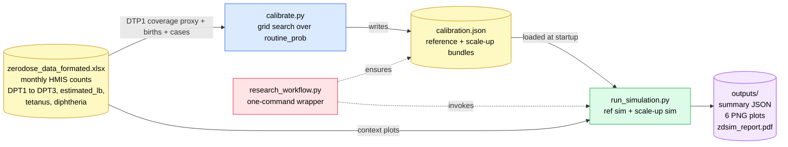

**Two stages by design.** Calibration is slow (it sweeps 14 short sims in a grid); simulation is fast. Separating them lets researchers re-run scenarios without recalibrating each time.

---

## 2. Repository map

```
zdsim/
├── run_simulation.py              ▶ entry point — all runtime config in main()
├── calibrate.py                   🔧 standalone grid-search calibrator
├── research_workflow.py           🎛 convenience wrapper (calibrate → simulate)
│
├── zdsim/                         📦 importable package
│   ├── __init__.py                exposes ZeroDoseVaccination + 5 disease classes
│   ├── interventions.py           ZeroDoseVaccination
│   ├── zerodose_calibration.py    SimulationParameterBundle + build_calibration_bundle
│   ├── zerodose_data.py           xlsx loader + DTP1/zero-dose proxy
│   ├── reporting.py               PDF report generator (reportlab)
│   └── diseases/
│       ├── tetanus.py             environmental SIS + waning + 4 age bands
│       ├── diphtheria.py          SIR
│       ├── pertussis.py           SIRS (exponential waning)
│       ├── hepatitis_b.py         SIR + chronic carriers
│       └── hib.py                 SIR + meningitis flag
│
├── zdsim/data/zerodose_data_formated.xlsx
├── calibration.json               generated; auto-detected by run_simulation.py
├── outputs/                       generated per run
├── tests/test_smoke.py
└── docs/
    ├── ARCHITECTURE.md            ← this file
    └── Zero-Dose Vaccination ABM Report.pdf
```

---

## 3. Data → calibration → simulation flow

### 3a. From xlsx to empirical proxy

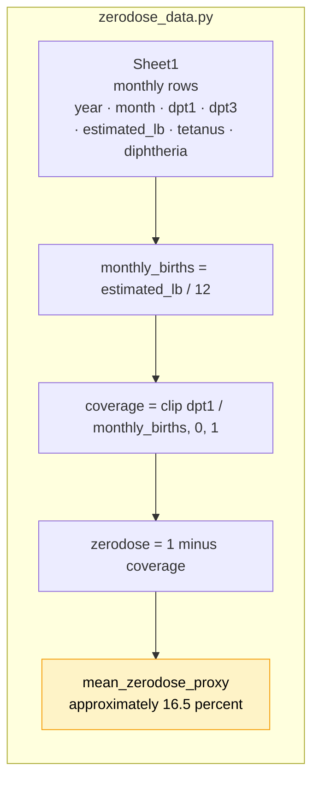

### 3b. Calibration grid search

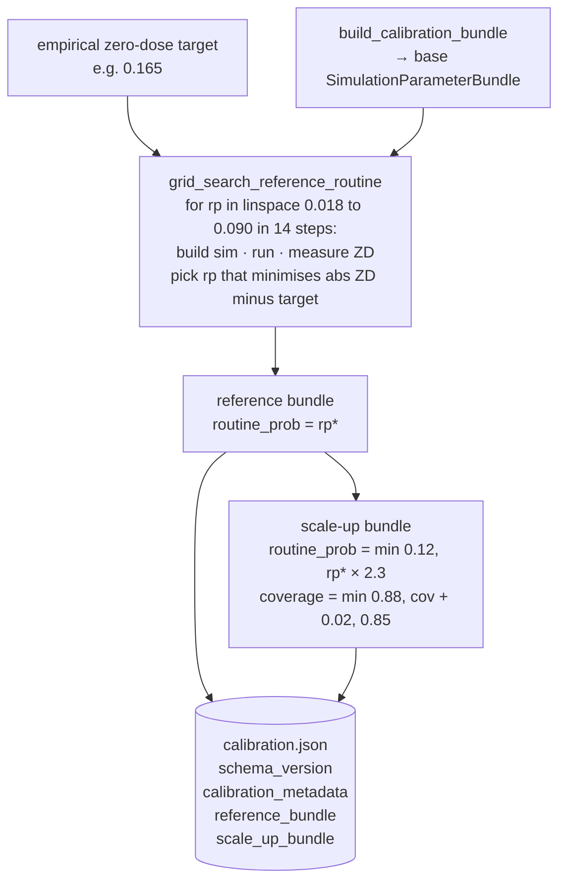

**Each of the 14 trial sims is short and small** — `CALIB_N_AGENTS = 10,000` agents over `CALIB_YEARS = 8` years — so the whole grid completes in a few minutes.

### 3c. Simulation stage (runtime)

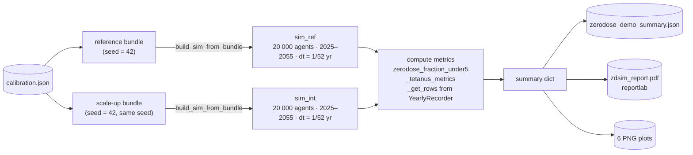

---

## 4. Core data structures

### SimulationParameterBundle

A frozen dataclass — immutable, copy-on-write via `dataclasses.replace`. **Everything** needed to build one scenario is in here; `build_sim_from_bundle` reads from nothing else.

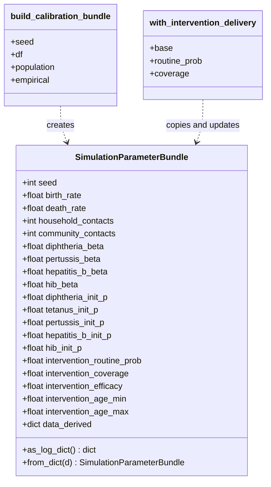

Fields come from three places:

| Origin | Fields |
|---|---|
| **Derived from xlsx** | `birth_rate` (from `estimated_lb`), `intervention_coverage` (mean DTP1 proxy), all `*_init_p` (scaled from reported case counts) |
| **Derived by calibration** | `intervention_routine_prob` |
| **Fixed constants** | `household_contacts = 5`, `community_contacts = 15`, `intervention_efficacy = 0.9`, age window `[0, 5]` yr, per-disease `*_beta` |

> ⚠️ **The disease module `__init__` defaults for `beta` are overridden.** `run_simulation.py:build_sim_from_bundle` explicitly passes the bundle's `*_beta` values. See [§7](#7-disease-modules).

---

## 5. Simulation anatomy (what lives inside `ss.Sim`)

Every scenario is one `ss.Sim` instance composed of five groups of modules.

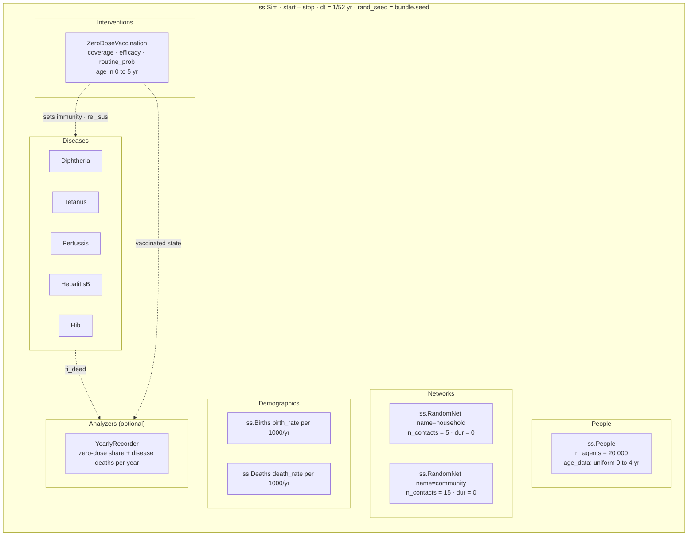

---

## 6. Timestep execution order

Starsim runs these phases in order on each of the ~1,560 weekly timesteps across a 30-year run.

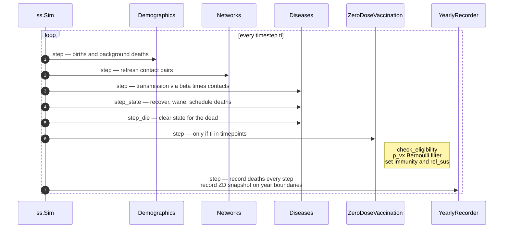

Within each step the vaccination intervention runs **after** the diseases, so immunity acquired this week influences next week's transmission — not this week's.

---

## 7. Disease modules

All five inherit from `ss.Infection` and follow the same skeleton:

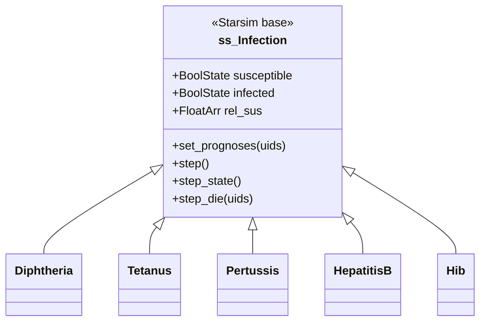

### 7a. Pentavalent SIR diseases (4 modules)

Shared structure — person-to-person transmission via the two `RandomNet` networks:

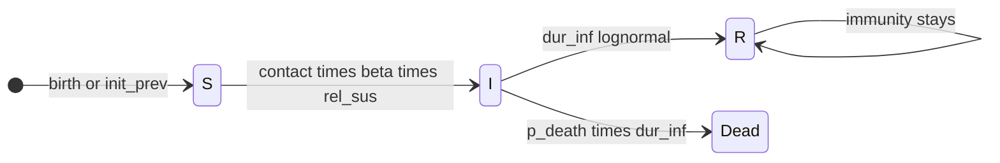

| Module | `beta` used at runtime | `dur_inf` (mean) | `p_death` | Extra dynamic |
|---|---|---|---|---|
| **Diphtheria** | bundle = **0.15/yr** (default 6.0) | 0.5 yr | 5% | immunity = 0.8 on recovery |
| **Pertussis** | bundle = **0.25/yr** (default 46.0) | 0.25 yr | 1% | exponential immunity waning @ 0.1/yr |
| **HepatitisB** | bundle = **0.08/yr** (default 0.5) | 2.0 yr | 2% | 5% of infections stay chronic (never clear) |
| **Hib** | bundle = **0.12/yr** (default 17.5) | 0.1 yr | 3% | 10% flagged as meningitis |

> Bundle `*_beta` values are intentionally small — the model is deliberately tuned low so that **vaccination impact on zero-dose share**, not disease epidemiology, drives the headline results.

### 7b. Tetanus — environmental SIS with four age bands

Tetanus gets a separate diagram because it differs structurally: **no person-to-person β** — agents acquire tetanus from wound exposure at an age-specific rate.

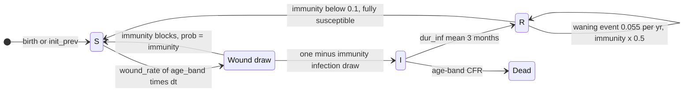

**Four age bands** (resolved from `age * 365` days):

| Band | Ages | Wound rate/yr | CFR |
|---|---|---|---|
| Neonatal | 0–28 days | **0.0111** | **71.8%** |
| Peri-neonatal | 29–60 days | **0.0213** | **52.1%** |
| Childhood | 2 months – 15 years | **0.0637** | **48.0%** |
| Adult | 15+ years | **0.6346** | **32.7%** |

Each event type (wound, infection, waning, death) has its own RNG stream (`ss.random()`) so streams are CRN-stable across scenarios.

---

## 8. ZeroDoseVaccination intervention

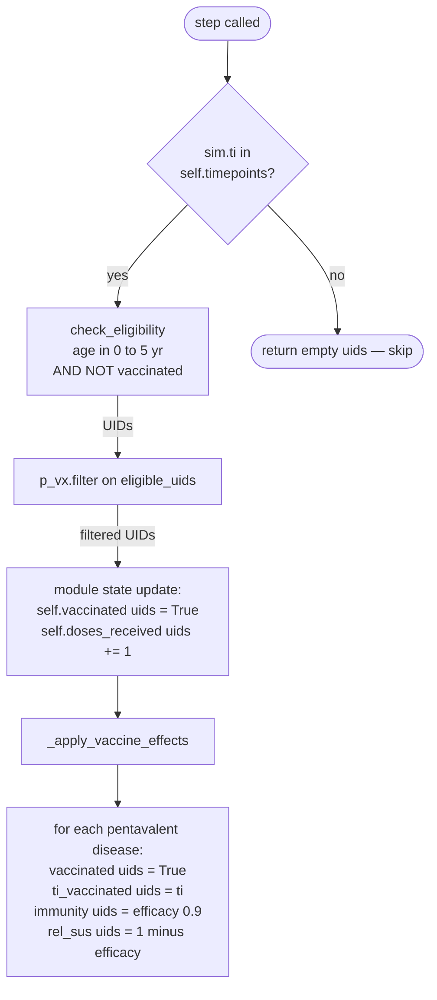

### Per-step probability logic

```python
if pars.year is not None:        # campaign mode
    p = pars.coverage
else:                            # routine mode (default)
    p = pars.routine_prob * pars.coverage
```

| Mode | Enabled when | Timepoints | Per-step p |
|---|---|---|---|
| **Routine** | `year=None` (default) | every step in `[start_day, end_day]` | `routine_prob × coverage` |
| **Campaign** | `year=[y1, y2, ...]` | timesteps nearest to each target year | `coverage` |

**Why this shape?** `routine_prob` is the per-week probability a given child encounters the health system; `coverage` is the probability they actually get jabbed conditional on that encounter. Multiplying gives the weekly vaccination probability.

---

## 9. Analyzers and outputs

### YearlyRecorder

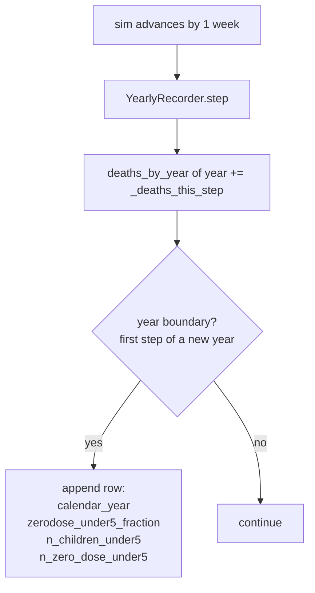

### Output computation graph

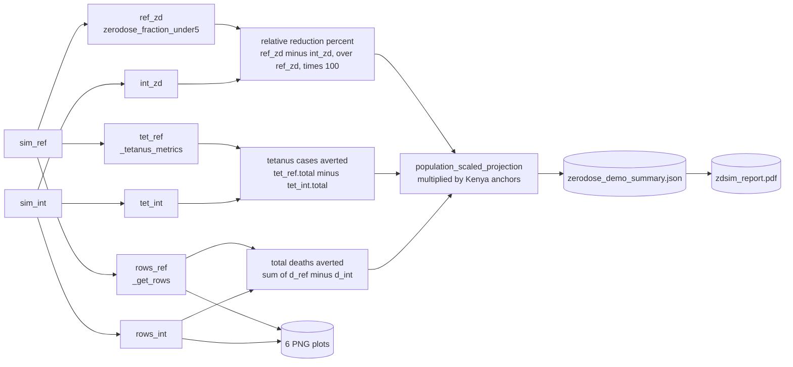

### Output files (all under `outputs/`)

| File | What it shows |
|---|---|
| `zerodose_demo_summary.json` | Full summary dict (metrics + yearly rows + scaled projections) |
| `zerodose_impact.png` | End-of-window bar chart: reference vs intervention ZD share |
| `projection_zerodose_20y.png` | Yearly ZD share trajectory |
| `projection_disease_deaths.png` | Yearly disease-attributable deaths |
| `tetanus_reference_vs_intervention.png` | New tetanus infections over time |
| `admin_data_dtp1_zerodose_timeseries.png` | Empirical DTP1 / zero-dose proxies from xlsx |
| `admin_data_dpt123_vs_births.png` | DPT1/3 dose counts vs estimated live births |
| `zdsim_report.pdf` | Narrative PDF report (title → abstract → methods → results → discussion) |

---

## 10. Population scaling to Kenya anchors

Agent counts are small (20k) for speed, so headline figures are scaled to Kenya national anchors.

```
KENYA_UNDER5_POPULATION     = 7,200,000    # UN WPP 2024
KENYA_ANNUAL_LIVE_BIRTHS    = 1,270,000    # WHO/UNICEF WUENIC 2024
model_births_per_year       = n_agents × birth_rate / 1000
scale                       = KENYA_ANNUAL_LIVE_BIRTHS / model_births_per_year

zero_dose_children_reached         = (ref_zd − int_zd) × 7_200_000
total_disease_deaths_averted_scaled = death_av × scale
tetanus_cases_averted_scaled        = tet_av × scale
```

---

## 11. Design decisions

| Decision | Rationale |
|---|---|
| **Calibration split from simulation** | Grid search is expensive (14 short sims); scenario runs are cheap. Separating means researchers tweak and rerun without re-sweeping. |
| **Both arms share the same seed by default** | Matched counterfactual — noise cancels and observed deltas are attributable to the intervention, not RNG draws. |
| **`SimulationParameterBundle` is frozen** | Immutable value type; scenarios are built via `dataclasses.replace`, so one bundle can never mutate another. |
| **Tetanus = SIS + wound exposure** | Real tetanus doesn't transmit person-to-person, and immunity wanes — modeling it as SIR would misrepresent both. |
| **`dt = 1/52` (weekly)** | Coarse enough to run a 30-year × 20k-agent simulation in seconds; fine enough to resolve the 28-day neonatal tetanus window. |
| **All runtime config in `run_simulation.py:main()`** | No `argparse` — researchers change one file in one place. Calibration config still lives in `calibrate.py`'s CLI since it's a tool, not an experiment. |
| **Bundle `*_beta` overrides module defaults** | Keeps module defaults as sensible epidemiological values, but lets the study deliberately tune effective transmission low to isolate the zero-dose signal. |
| **One RNG stream per tetanus event type** | Common Random Numbers: flipping `routine_prob` in the scale-up arm changes vaccination draws without shifting wound/infection/death draws, so signal > noise. |
| **Kenya anchors applied post-hoc** | The ABM runs on 20k cohort agents; real-world headcounts come from a deterministic multiplier — keeps simulation cheap and makes the scaling assumption explicit. |

---

*Last verified against source: `run_simulation.py` (478 lines), `zdsim/interventions.py` (104 lines), five disease modules, and `zdsim/zerodose_calibration.py`.*
